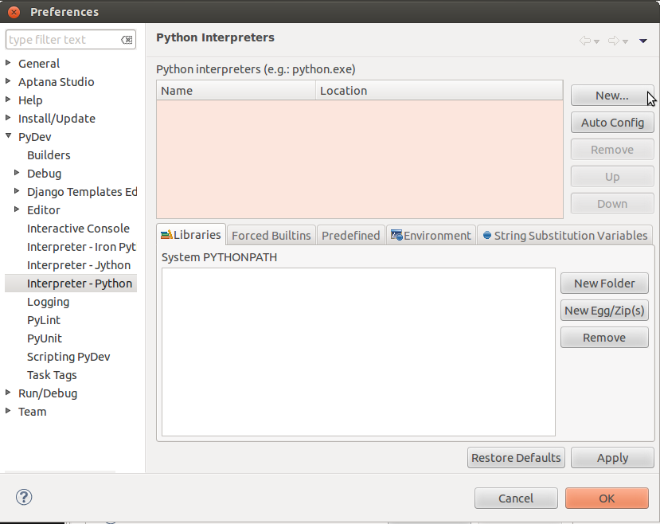
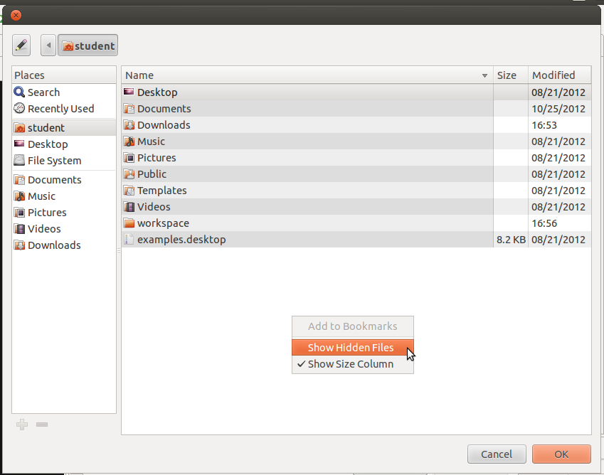
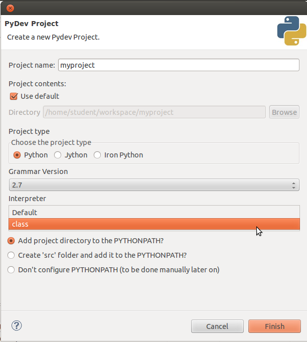

*************
Aptana Studio
*************

`Aptana Studio`_ is an IDE - `integrated development environment`_ - based on
the `Eclipse framework`_.  It provides powerful tools for exploring,
understanding, and refactoring your code.

Because Aptana Studio is Eclipse + a plugin, in class I may refer to "Aptana"
and "Eclipse" interchangeably.  Unless explicitly noted, both terms refer to the
combination of Eclipse framework + Aptana Studio plugin.

Aptana's Python support was formerly a separate Eclipse plugin called *PyDev*. 
PyDev was purchased by Aptana and folded into Aptana Studio. Aptana can be
installed as a seperate download, or as an Eclipse plugin.  For convenience we
will download the whole application.

   http://aptana.com/products/studio3/download

.. _integrated development environment: http://en.wikipedia.org/wiki/Integrated_development_environment
.. _Aptana Studio: http://aptana.com/
.. _Eclipse framework: http://eclipse.org

Workspace
=========

When it starts up, Aptana will ask you what folder you want to use as a
workspace.  The default is not very good, as its name contains spaces:

Instead use ``~/workspace``, the standard Eclipse workspace path.  You can tell
Aptana to remember this workspace if you like.

Harmless ``libjpeg`` Error
==========================

The first time you start Apatana Studio, you will get a frightening-looking
error message, complaining that libjpeg.62.so is missing.  This error is
actually quite harmless - it is caused by Aptana trying to display it's one-time
splash screen after a new install.  To display the splash screen requires a JPEG
graphic handling library that we have not installed.  

Click OK, and Eclipse will ask if you want to exit.  Say yes, wait for Eclipse
to exit, then launch it again.  You will only see this error message the first
time; thereafter, launch will be error-free.

This bug can be avoided entirely by installing ``libjpeg62``:

.. code-block:: console

   $ sudo apt-get install libjpeg62

However this is not strictly necessary, as the bug does not damage anything, and
appears only the first time a new Apatana installation is run.

Installing Eclipse Plugins
==========================

Each Eclipse plugin has an *Update Site* URL, from which it can be installed.

To install a plugin in Eclipse, choose ``Install New Software...`` from the
``Help`` menu.  Click the ``Add...`` button to add a new plugin repository.  Put
the plugin's *Update Site* URL in the ``Location:`` field.

Once you have added the plugin repository, check the box of the plugin you want
to install.  Click ``Next >``, then click thru until it is installed.  Normally
Eclipse will want to restart itself after a new plugin has been installed.

Vwrapper
--------

Vrapper is an Eclipse plugin providing VI-keys support.  Only install this
plugin if you are *certain* you want it.

Update site:

   ``http://vrapper.sourceforge.net/update-site/stable``

Python Perspective
==================

Eclipse refers to collections of windows (*views* in Eclipse terminology) and
their arrangement on screen as a *perspective*.  There is a Python perspective
available, pre-configured with the views one typically wants while working on
Python code.

You can select the Python perspective by going to the *perspective menu* - it is
in the upper right corner of the window, and looks like a grid with a plus sign.
Click on it, select "Other...", and choose "PyDev Perspective" from the ensuing
dialog.

You will now be in the Python perspective.

   
Working with Virtual Environments
=================================

Unfortunately, Aptana is not aware of virtual environments by default.  This can
be worked around by manually configuring Aptana to use the Python interpreter
from the virtual environment.  We will configure the interpreter in the course
of starting a new project below.

Starting a New Project
======================

Start a new project by clicking on the new project menu - it looks like a window
with a plus sign - in the upper left corner of the window.  Click on the new
project menu, and select "PyDev Project".

A new project dialog will appear.  Fill in the name you want for your project,
then click on the blue "Please configure an interpreter" link.  

You will be taken to Eclipse's Python interpreter settings page.  

Click the "New..." button.  A select file dialog will open; go to your home
folder.  Once there, right-click on the file list, and choose "Show Hidden
Files" from the context menu.

Click thru to select the ``python`` executable at ``~/.virtualenvs/class/bin/python``.

Click OK, and you will return to the Select Interpreter dialog, which will look like this:

Click "OK", and you will return to the PyDev Project dialog.  From the
"Interpreter" popup menu, choose "class", the virtualenv we just configured.

Click "Finish" and you will have successfully created a new project!   Your new
project will now be visible in the Project Explorer view.

